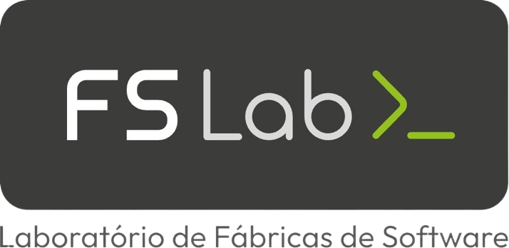

<p align="center">
  
  <br />
  <br />

 <h1 align="center">📦 API Academia FSLab</h1>
</p>


Plataforma para gerenciamento de usuários, cursos e conteúdos educacionais da Academia FSLab.

---

## 📑 Sumário

- [📦 API Academia FSLab](#api-academia-fslab)
- [🌐 Acesse a documentação em produção](#acesse-a-documentação-em-produção)
- [🚀 Funcionalidades](#-funcionalidades)
- [🛠 Tecnologias Utilizadas](#-tecnologias-utilizadas)
- [📂 Estrutura de Pastas](#-estrutura-de-pastas)
- [▶️ Como Rodar Localmente](#️-como-rodar-localmente)
- [🔐 Variáveis de Ambiente](#-variáveis-de-ambiente)
- [👨‍💻 Autor](#-autor)

---

## 🌐 Acesse a documentação em produção:  


🔗 [https://api-academia.app.fslab.dev/docs/](https://api-academia.app.fslab.dev/docs/)

---

## 🚀 Funcionalidades

- Autenticação via JWT
- Cadastro e gerenciamento de usuários
- Sistema de permissões
- Gerenciamento de cursos, conteúdos e inscrições
- Emissão de certificados
- Integração com Swagger para documentação
- Testes unitários e de integração

---

## 🛠 Tecnologias Utilizadas

- Node.js
- Express
- Prisma ORM
- Swagger
- Docker
- JWT
- Bcrypt
- Dotenv
- Zod
- MinIO
- MJML
- Jest

---

## 📂 Estrutura de Pastas

```
academia-fslab-back-end/
├── assets/
│   └── logo.png
├── deployment/
│   ├── deployment.yaml
│   ├── minio-academia-config.yaml
│   └── minio-academia.yaml
├── prisma/
│   ├── schema.prisma
│   └── migrations
├── src/
│   ├── app.js
│   ├── config/
│   ├── controller/
│   ├── docs/
│   ├── middleware/
│   ├── routes/
│   ├── schema/
│   ├── seed/
│   ├── services/
│   └── utils/
├── templates/
│   ├── recuperaSenha.mjml
│   └── verificaEmail.mjml
├── tests/
│   ├── images/
│   ├── integration/
│   └── unit/
├── .dockerignore
├── .env
├── .env.example
├── .env.test
├── .gitignore
├── .gitlab-ci.yml
├── babel.config.js
├── docker-compose-banco.yml
├── docker-compose-minio.yml
├── DockerFile
├── jest.config.js
├── jest.setup.js
├── package-lock.json
├── package.json
├── README.md
└── server.js
```

---

## ▶️ Como Rodar Localmente

```bash
# 📦 Clone o repositório
git clone ssh://git@gitlab.fslab.dev:4241/academia-fslab/academia-fslab-back-end.git

# 💻 Acesse o diretório do projeto
cd academia-fslab-back-end

# 📥 Instale as dependências
npm install

# ⚙️ Configure as variáveis de ambiente
cp .env.example .env
nano .env   # edite conforme necessário

# 🚀 Inicie a aplicação
npm start

> academia-fslab-back-end@1.0.0 start
> node src/main.js

✅ Servidor rodando em: http://localhost:3000
```

## 🔐 Variáveis de Ambiente

Crie um arquivo `.env` com o seguinte conteúdo:

```env
#variavel de debug
DEBUGLOG=true
PORT=

DB_URL=

#JWT
JWT_SECRET=
JWT_EXPIRATION=1d
JWT_EXPIRATION_RECUPERA_SENHA=30m

LOGIN_ADMINISTRADOR_PADRAO = 
SENHA_ADMINISTRADOR_PADRAO = 

#minio
MINIO_ENDPOINT = 'localhost'
MINIO_PORT = 9000
MINIO_ACCESS_KEY = 'ROOTUSER'
MINIO_SECRET_KEY = 'CHANGEME123'
MINIO_USE_SSL = false


#Váriavel de envio de email FS-Mail
FS_MAIL_ADDRESS=
FS_MAIL_API_KEY=
FS_MAIL_API_URL=

```
---

## 👨‍💻 Autor

<p align="center">
  <a href="https://github.com/pablosmolak">
  <br/>
  Pablo Smolak</a>
</p>

<br>

<p align="center">🧪 Projeto desenvolvido como parte do Trabalho de Conclusão de Curso 🚀</p>

